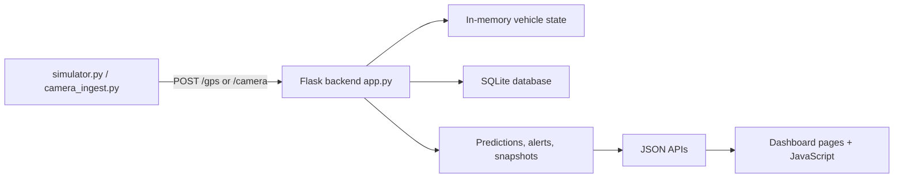

# Tharani Sengol / GeoGuard Complete Project Documentation

This document explains the project end to end: the tech stack, repository layout, runtime flow, prediction logic, output fields, calculation formulas, and the major code paths that power the system.

## 1. Project Summary

Tharani Sengol, also referred to in some documents as GeoGuard, is a Flask-based vehicle monitoring and risk intelligence system for heavy trucks. It combines live telemetry, geospatial checks, rule-based scoring, machine learning inference, and a browser dashboard to monitor route compliance, risk, overload, and suspicious behavior.

The current active implementation is the root-level Flask project in this workspace. The `geoguard-phase4/` folder is not the main runtime entrypoint.

## 2. What The System Does

The system continuously:

1. Receives simulated or real GPS telemetry.
2. Updates per-vehicle state in memory and SQLite.
3. Checks geofences, route deviation, permit status, spoofing, convoy behavior, and stale GPS conditions.
4. Computes a risk score and a near-term violation probability.
5. Estimates vehicle weight and overload risk.
6. Detects anomalies and builds a final fused threat score.
7. Stores events, alerts, violations, snapshots, and trip summaries.
8. Exposes APIs and HTML pages for dashboards, alerts, analytics, and administration.

## 3. Tech Stack

### Backend

- Python
- Flask
- SQLite via `sqlite3`
- PyJWT for login tokens
- shapely for geospatial logic
- scikit-learn for runtime ML modules
- joblib for loading the saved weight model
- shap for explainability when available

### Data and ML

- pandas
- numpy
- scikit-learn models
- RandomForestClassifier training asset for violation classification
- RandomForestRegressor for weight prediction training
- IsolationForest for runtime anomaly detection

### Frontend

- HTML templates rendered by Flask
- Vanilla JavaScript modules in `static/`
- CSS in `static/site.css`

### Supporting Utilities

- OpenCV for camera ingestion
- requests for HTTP posting from simulator/camera code
- qrcode and Pillow in the broader environment

## 4. Repository Structure

Important files and folders:

- [app.py](app.py) - main backend and API server
- [run_all.py](run_all.py) - orchestration launcher for backend and simulator
- [simulator.py](simulator.py) - fleet/GPS simulator
- [camera_ingest.py](camera_ingest.py) - camera or virtual camera ingestion
- [dataset_gen.py](dataset_gen.py) - classification dataset generation
- [weight_dataset_gen.py](weight_dataset_gen.py) - weight dataset generation
- [train_model.py](train_model.py) - trains the classification model
- [train_weight_model.py](train_weight_model.py) - trains the weight regression model
- [requirements.txt](requirements.txt) - dependency list
- [templates/](templates/) - server-rendered HTML pages
- [static/](static/) - JavaScript and CSS
- [trichy_vehicle_dataset.csv](trichy_vehicle_dataset.csv) - classification dataset
- [weight_dataset.csv](weight_dataset.csv) - weight regression dataset
- [user_accounts.json](user_accounts.json) - local login store
- [tharani_sengol.db](tharani_sengol.db) - SQLite database created at runtime

## 5. Runtime Entry Points

### Run everything together

```bash
python run_all.py
```

This starts the Flask backend and the simulator, and can optionally start camera ingestion.

### Run the backend directly

```bash
python app.py
```

### Train the models

```bash
python train_model.py
python train_weight_model.py
```

## 6. Orchestration Flow

The orchestration script [run_all.py](run_all.py) sets runtime environment values, launches the backend, then starts the simulator after a short delay.

```python
backend_cmd = [py_exec, "app.py"]
simulator_cmd = [py_exec, "simulator.py"]
camera_cmd = [py_exec, args.camera_script]

backend = subprocess.Popen(backend_cmd, cwd=BASE_DIR, env=child_env)
time.sleep(2)
simulator = subprocess.Popen(simulator_cmd, cwd=BASE_DIR, env=child_env)
```

It also sets configuration values such as fleet size, route count, and weight lock thresholds through environment variables.

## 7. Backend Architecture

The backend is the brain of the system. It is a Flask app that:

- receives telemetry on `/gps` and `/camera`
- keeps live state in memory per vehicle
- stores events and snapshots in SQLite
- computes risk, predictions, anomaly scores, and final threat scores
- serves APIs for the dashboard and admin views
- enforces login and role-based access control

### Core runtime initialization

```python
app = Flask(__name__, template_folder=str(BASE_DIR / "templates"), static_folder=str(BASE_DIR / "static"))
WEIGHT_MODEL_PATH = BASE_DIR / "weight_model.pkl"
DB_PATH = BASE_DIR / "tharani_sengol.db"
WEIGHT_LIMIT_TONS = 20.0
WEIGHT_LOCK_MIN_DISTANCE_KM = float(os.getenv("THARANI_WEIGHT_LOCK_MIN_DISTANCE_KM", "0.35"))
WEIGHT_LOCK_MIN_TRIP_MINUTES = float(os.getenv("THARANI_WEIGHT_LOCK_MIN_TRIP_MINUTES", "1.2"))
```

## 8. Main Runtime Data Flow

### End-to-end flow



### What happens for each GPS event

1. Receive payload at `/gps`.
2. Resolve route and zone.
3. Update the current vehicle state.
4. Check compliance rules and geofences.
5. Update weight features and possibly lock a prediction.
6. Update behavior, anomaly, and threat calculations.
7. Persist GPS event and snapshot rows.
8. Return a JSON response containing the latest outputs.

## 9. Telemetry Ingestion Payloads

### GPS payload

The backend expects a JSON body with fields similar to:

```json
{
  "vehicle_id": "truck_1",
  "lat": 10.7905,
  "lon": 78.7047,
  "timestamp": "2026-07-03T10:30:00+00:00",
  "route_id": "route_1"
}
```

### Camera payload

```json
{
  "camera_id": "camera_1",
  "lat": 10.79,
  "lon": 78.70,
  "truck_count": 4,
  "timestamp": "2026-07-03T10:30:00+00:00",
  "route_id": "route_1"
}
```

## 10. Vehicle State Model

Each vehicle has a live state dictionary in memory. The state stores:

- current route and district
- current zone type and zone name
- trip count and 24-hour trip count
- risk score and history
- prediction label and probability
- speed samples and speed deltas
- weight history and latest locked weight prediction
- anomaly score and anomaly flag
- final fused threat score

The first-time state template is created in `ensure_vehicle_state()`.

## 11. Risk Score Calculation

Risk is not a single ML model output. It is a rule-driven score that grows when the system detects violations or suspicious behavior.

### Core update function

```python
def update_risk(vehicle_id: str, reason: str, points: float, severity: str = "warning", lat: Optional[float] = None, lon: Optional[float] = None):
    state = ensure_vehicle_state(vehicle_id)
    profile_cfg = PROFILE_CONFIG[state["profile"]]
    scaled_points = float(points) * profile_cfg["risk_multiplier"]
    hard_cap = float(profile_cfg.get("risk_cap", 100.0))
    if severity == "critical":
        hard_cap = min(100.0, hard_cap + 8.0)
    state["risk"] = clamp(state["risk"] + scaled_points, 0.0, hard_cap)
```

### How it is calculated

- Every event has a base point value, for example route deviation or permit violation.
- The current vehicle profile scales the points.
- Critical issues can raise the effective cap.
- The result is clamped between 0 and the configured cap.
- Each update is recorded in the history table and risk timeline.

### Risk decay

Risk decays over time using `apply_smart_decay()`.

The decay amount depends on:

- time elapsed since last decay
- whether the vehicle had recent violations
- the vehicle profile decay multiplier

This prevents old issues from dominating forever while still keeping a recent history visible.

## 12. Near-Term Violation Prediction

The prediction module computes the probability that a vehicle will be high-risk or violate rules in the near future.

### Formula

The system builds a linear score and then applies a sigmoid:

$$
p = \frac{1}{1 + e^{-z}}
$$

where $z$ is built from the current risk, recent events, speed, stale GPS, trend, anomaly factor, and GPS confidence.

### Exact components in code

```python
linear = (
    -2.25
    + bias
    + ((anomaly_factor - 1.0) * 0.70)
    + (0.030 * risk)
    + (0.75 * recent_critical)
    + (0.30 * recent_warning)
    + (0.50 * speed_flag)
    + (0.40 * stale_flag)
    + (0.45 * trend_component)
    + ((0.9 - gps_confidence) * 0.35)
)
probability = 1.0 / (1.0 + exp(-linear))
```

### Inputs used

- current risk score
- recent critical events in the last 10 minutes
- recent warning events in the last 10 minutes
- very high recent speed
- stale GPS status
- profile-specific bias
- anomaly control factor
- GPS confidence
- risk trend from the timeline

### Labeling logic

- `HIGH` if probability is at least `0.78`
- `MEDIUM` if probability is at least `0.48`
- otherwise `LOW`

### Reason field

The reason text is chosen from the strongest signal:

- critical anomaly observed
- frequent warning events
- risk rising quickly
- high current risk
- stable

### Output example

```json
{
  "probability": 0.842,
  "label": "HIGH",
  "reason": "critical anomaly observed",
  "gps_confidence": 0.9
}
```

## 13. Weight Prediction / Load Estimation

The weight module estimates the truck's load in tons. It is the main regression output of the project.

### When prediction is locked

The system only locks a weight prediction when:

- the vehicle is in the `to_dump` stage
- trip distance is at least `WEIGHT_LOCK_MIN_DISTANCE_KM`
- trip time is at least `WEIGHT_LOCK_MIN_TRIP_MINUTES`

Once locked, the prediction remains fixed for the trip.

### Weight feature builder

```python
def build_weight_features(state: dict, now: datetime) -> dict:
    trip_time = max((now - trip_started).total_seconds() / 60.0, 1.0)
    route_distance_km = max(float(state.get("trip_distance_m", 0.0)) / 1000.0, 0.01)
    avg_speed = route_distance_km / max(trip_time / 60.0, 1e-3)
    max_speed = max(float(state.get("max_speed", 0.0)), float(state.get("recent_speed_kmh", 0.0)))
    stops_count = int(state.get("stops_count", 0))
    acceleration_variation = statistics.pstdev(speed_deltas) if len(speed_deltas) >= 2 else ...
```

### Features passed to the model

- `trip_time`
- `avg_speed`
- `max_speed`
- `stops_count`
- `acceleration_variation`
- `route_distance`
- `trip_number`
- `time_of_day`

### Runtime model loading

The backend tries to load `weight_model.pkl` with joblib.

If the model is available, it predicts from the feature row. If not, a heuristic fallback is used.

### Model-backed calculation

```python
predicted = float(WEIGHT_MODEL.predict([row])[0])
```

### Confidence calculation

- If the model has tree estimators, prediction spread across trees is used to estimate confidence.
- Otherwise a default confidence of `0.84` is used.

### Heuristic fallback calculation

If the model cannot be loaded, the system estimates weight using a weighted sum:

```python
predicted = (
    3.75
    + (0.18 * trip_time)
    + (0.22 * route_distance)
    + (0.11 * stops_count)
    + (0.07 * acceleration_variation)
    + (0.03 * trip_number)
    + (0.015 * max_speed)
    - (0.12 * avg_speed)
    + (0.05 * max(0.0, 18.0 - avg_speed))
    + (0.02 * abs(time_of_day - 13.0))
)
```

### Final constraints

- weight is clamped to the range `2.0` to `42.0` tons
- `confidence` is rounded to three decimals
- `source` is `model` or `heuristic`

### Overload rule

The overload flag becomes true when:

$$
\text{predicted weight} > 20.0 \text{ tons}
$$

### Weight output structure

```json
{
  "predicted_weight": 24.18,
  "average_weight": 22.74,
  "confidence": 0.84,
  "source": "model",
  "limit": 20.0,
  "overload_flag": true,
  "is_locked": true,
  "lock_distance_km": 0.35,
  "lock_trip_minutes": 1.2,
  "distance_km": 1.214,
  "trip_time_min": 7.83,
  "features": {
    "trip_time": 7.83,
    "avg_speed": 9.31,
    "max_speed": 28.4,
    "stops_count": 3,
    "acceleration_variation": 2.117,
    "route_distance": 1.214,
    "trip_number": 4,
    "time_of_day": 10
  }
}
```

## 14. Anomaly Detection

The anomaly module flags unusual behavior.

### Runtime inputs

- trip time
- average speed
- maximum speed
- stop count
- acceleration variation
- route distance
- current risk
- current violation probability

### Calculation path

1. Add the latest feature vector to the anomaly buffer.
2. Refit an IsolationForest periodically after enough samples are available.
3. Score the current vector.
4. Convert the raw score to a normalized anomaly score between 0 and 1.

### Heuristic fallback

If IsolationForest is not available, the score is computed from risk, speed, fluctuation, stop ratio, and prediction probability.

### Output

- `anomaly_score` as a number between 0 and 1
- `anomaly_flag` when the score is at least `0.72`

## 15. Final Threat Score

The final threat score fuses the major signals into one operational metric.

### Formula

```python
fusion = clamp((0.45 * risk) + (0.35 * probability) + overload_boost + anomaly_boost + driver_boost, 0.0, 100.0)
```

Where:

- `risk` is the current risk score
- `probability` is the violation probability as a percentage
- `overload_boost` is `14.0` when overload is active
- `anomaly_boost` is `anomaly_score * 24.0`
- `driver_boost` is `8.0` if driver behavior is risky

### Output range

- minimum `0`
- maximum `100`

This metric is used to sort fleet rows and prioritize attention in dashboards.

## 16. Driver Behavior Metrics

The driver behavior module summarizes how aggressively a vehicle is moving.

### Inputs

- recent speed deltas
- recent speed samples
- current profile
- current risk
- anomaly score

### Calculations

- `harsh_braking` counts recent speed deltas greater than or equal to `18.0`
- `speed_fluctuation` is the population standard deviation of recent speeds
- thresholds vary by profile (`safe`, `normal`, `high_risk`)

The output includes whether the driver is considered risky and whether the behavior matches the expected profile.

## 17. Geospatial and Compliance Logic

The system uses `shapely` polygons and route lines to check location-based behavior.

### Checks performed

- forbidden zone entry
- unauthorized mine entry
- route deviation from the expected route line
- GPS spoofing or impossible jumps
- convoy behavior
- permit validity
- permit trip and quantity limits

### Geofence behavior

If a truck enters a forbidden area or unauthorized mine zone, the system:

- increases risk
- appends an alert
- stores a violation record
- may mark the event as critical

## 18. Database and Persistent Storage

The backend uses SQLite for durable history. The database file is `tharani_sengol.db`.

The live code writes into tables such as:

- `gps_events`
- `alerts`
- `violations`
- `trip_records`
- `vehicle_snapshots`
- `permits`

The app also reads from and updates vehicle/account data in `user_accounts.json`.

## 19. Authentication and Authorization

Login is handled with JWT.

### Flow

1. User submits credentials to `/api/auth/login`.
2. Backend validates against `user_accounts.json`.
3. A JWT is issued.
4. The token is stored in an HTTP-only cookie named `tharani_token`.
5. `@app.before_request` enforces access rules for protected pages and APIs.

### Roles

- `admin`
- `officer`
- `owner`
- `operator`

### Access control

The backend restricts pages such as admin and module prediction views based on role.

## 20. Main API Groups

### Authentication

- `/api/auth/login`
- `/api/auth/logout`
- `/api/auth/me`
- `/api/users`

### Telemetry and operations

- `/gps`
- `/camera`
- `/api/routes`
- `/api/vehicles`
- `/api/lorries`
- `/api/trips`
- `/api/alerts`

### Prediction and analytics

- `/api/predictions`
- `/api/ai-overview`
- `/api/module-predictions`
- `/api/driver-behavior`
- `/api/tn-dashboard-stats`
- `/api/heatmap`
- `/api/heatmap/clusters`
- `/api/risk-timeline`
- `/api/digital-twin`

### Vehicle detail and explainability

- `/api/vehicle/<vehicle_id>/detail`
- `/api/vehicle/<vehicle_id>/explain`

### Administration and permits

- `/api/control-state`
- `/api/admin/config`
- `/api/admin/control`
- `/api/admin/scenario`
- `/api/admin/reset-runtime`
- `/api/permits`
- `/api/permit/<permit_id>/qr`
- `/api/permit/verify`
- `/api/permit/revoke`

### Exports

- `/export/alerts.csv`
- `/export/violations.csv`
- `/export/trips.csv`

## 21. Primary Output Fields

### Response from `/gps`

The GPS endpoint returns a full state summary including:

- `vehicle_id`
- `route_id`
- `route_name`
- `zone_name`
- `zone_type`
- `event`
- `trips`
- `trips_24h`
- `risk`
- `risk_level`
- `prediction`
- `weight_prediction`
- `predicted_weight`
- `average_weight`
- `overload_flag`
- `driver_behavior`
- `anomaly_score`
- `anomaly_flag`
- `time_series_forecast`
- `final_threat_score`
- `district`
- `profile`
- `gps_confidence`

### Response from `/api/predictions`

Returns a map of vehicle IDs to prediction objects containing:

- `probability`
- `label`
- `reason`
- `gps_confidence`

### Response from `/api/ai-overview`

Summarizes:

- configured routes and vehicles
- high and medium predictions
- locked weight predictions
- overload counts
- average probability and average predicted weight

### Response from `/api/module-predictions`

Summarizes multiple modules, such as:

- anomaly distribution
- forecast rows
- driver behavior summary
- fusion ranking
- SHAP-like top features when explainability is available

## 22. Frontend Pages

The Flask templates in `templates/` provide these main views:

- `login.html`
- `dashboard.html`
- `vehicles.html`
- `vehicle_detail.html`
- `alerts.html`
- `analytics.html`
- `ai_prediction.html`
- `module_predictions.html`
- `driver_behavior.html`
- `government_dashboard.html`
- `admin.html`
- `index.html`

### Corresponding JavaScript modules

- `dashboard.js`
- `vehicles.js`
- `vehicle_detail.js`
- `analytics.js`
- `ai_prediction.js`
- `module_predictions.js`
- `driver_behavior.js`
- `government_dashboard.js`
- `auth.js`
- `login.js`
- `chatbot.js`
- `admin.js`

### CSS

- `static/site.css`

## 23. How The Frontend Uses The Backend

The frontend is mostly a polling and rendering layer.

Typical flow:

1. Page loads via Flask template.
2. JavaScript calls JSON endpoints such as `/api/lorries`, `/api/alerts`, `/api/map-context`, or `/api/ai-overview`.
3. The backend returns live state.
4. The JS updates cards, tables, charts, maps, and alert lists.

## 24. Model Training Scripts

### Violation classifier training

File: [train_model.py](train_model.py)

This script trains a RandomForestClassifier using features:

- speed
- trip_count
- route_deviation
- gps_signal_loss
- time_of_day
- day_of_week
- risk_score

It exports a model file named `illegal_mining_rf.pkl`.

### Weight regression training

File: [train_weight_model.py](train_weight_model.py)

This script trains a RandomForestRegressor using features:

- trip_time
- avg_speed
- max_speed
- stops_count
- acceleration_variation
- route_distance
- trip_number
- time_of_day

It exports a model file named `weight_model.pkl`.

### Important runtime note

The current live backend actively loads and uses `weight_model.pkl`. The violation classifier exists as a training artifact in the workspace and is documented here as part of the project pipeline, but it is not loaded directly in the visible runtime path of `app.py`.

## 25. Basic Code Snippets

### Flask route shape

```python
@app.get("/api/predictions")
def api_predictions():
    run_background_checks(utc_now())
    user = current_user()
    allowed = scoped_vehicle_ids_for_user(user)
    predictions = {
        vehicle_id: state.get("prediction", {"probability": 0.0, "label": "LOW", "reason": "n/a"})
        for vehicle_id, state in vehicle_state.items()
        if allowed is None or vehicle_id in allowed
    }
    return jsonify(predictions)
```

### GPS ingestion

```python
@app.post("/gps")
def receive_gps():
    payload = request.get_json(force=True, silent=False)
    data = GPSPayload(payload)
    return jsonify(process_gps(data))
```

### Prediction pipeline

```python
state = ensure_vehicle_state(vehicle_id, route_id, route_name)
check_geofence(...)
check_route_deviation(...)
check_spoof(...)
check_convoy(...)
check_permit(...)
update_weight_prediction(...)
update_driver_behavior(state)
compute_prediction(state)
update_anomaly_score(state, ...)
compute_lstm_style_forecast(state)
compute_fusion_threat_score(state)
```

## 26. How To Read The Outputs

If you want to interpret a vehicle quickly, use this order:

1. `risk` for rule-based danger.
2. `prediction.label` and `prediction.probability` for short-term violation likelihood.
3. `predicted_weight` and `overload_flag` for load compliance.
4. `anomaly_score` for unusual behavior.
5. `final_threat_score` for the combined operational priority.

## 27. What Is Calculated Where

### In memory

- current vehicle state
- rolling history
- risk timeline
- speed samples
- prediction objects
- anomaly buffers

### In SQLite

- GPS event history
- alerts
- violations
- trip records
- vehicle snapshots
- permit records

### In the browser

- tables
- charts
- heatmaps
- cards
- modals
- vehicle detail views

## 28. Key Configuration Values

- `THARANI_FLEET_SIZE` - configured fleet size
- `THARANI_ROUTE_COUNT` - configured route count
- `THARANI_SIM_FLEET_SIZE` - simulator fleet size
- `THARANI_WEIGHT_LOCK_MIN_DISTANCE_KM` - weight lock distance threshold
- `THARANI_WEIGHT_LOCK_MIN_TRIP_MINUTES` - weight lock time threshold
- `THARANI_JWT_EXPIRE_HOURS` - token lifetime
- `THARANI_JWT_SECRET` - JWT signing key

## 29. Practical System Interpretation

The project is designed as a layered decision system:

- rules detect known violations
- machine learning estimates future risk and load
- anomaly detection catches outliers
- fusion scoring ranks overall operational concern
- the dashboard turns those signals into a human-readable control surface

That is why the application can show both raw metrics and a prioritized final risk outcome.

## 30. Short Architecture Summary

If the project needs to be described in one sentence:

> A Flask application ingests vehicle telemetry, applies rule-based checks and ML inference, stores the results in SQLite, and exposes real-time fleet intelligence through a dashboard and JSON APIs.
