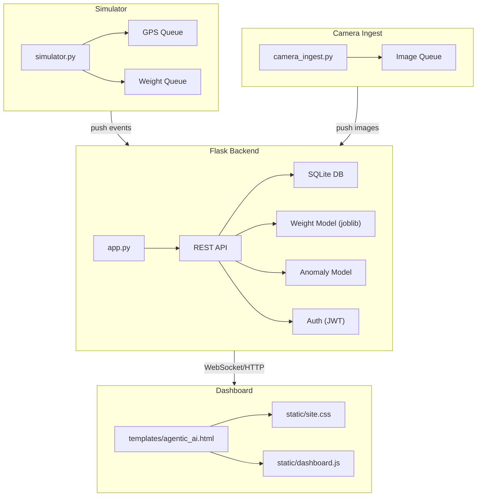
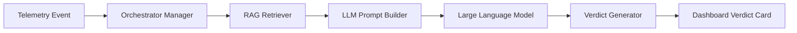

# Tharani Sengol


**Tharani Sengol** is an end‑to‑end simulation and monitoring platform for truck fleets operating across Tamil Nadu. It combines a Flask API backend, a real‑time dashboard, weight‑prediction AI, anomaly detection, and a cutting‑edge Agentic AI layer powered by Retrieval‑Augmented Generation (RAG) to give operators instant insight into vehicle health, load compliance, and route efficiency.

---

## Overview
- **Backend API** – `app.py` (Flask) exposing REST endpoints for authentication, vehicle telemetry, and AI predictions.
- **Simulator** – `simulator.py` synthesises GPS/weight streams for thousands of trucks.
- **Dashboard** – `templates/agentic_ai.html` with static assets renders live heat‑maps, alerts, and an interactive Agentic AI console.
- **AI Models** – `weight_model.pkl` (gradient‑boost) and IsolationForest for anomaly detection (loaded via `joblib`).
- **Camera ingest** – optional `camera_ingest.py` processes image feeds.
- **CLI Entrypoint** – `run_all.py` starts the backend, simulator, and optional camera ingest.
- **Agentic AI & RAG** – LangGraph‑style pipeline that composes LLM prompts using live telemetry, model outputs, and historical logs.

---

## Features
- Real‑time fleet tracking – GPS events stored in SQLite (`tharani_sengol.db`).
- Weight prediction – Gradient‑Boost model with SHAP explanations.
- Anomaly detection – IsolationForest with automatic background refitting.
- Role‑based access control – admin, officer, owner, operator (JWT).
- Dynamic Agentic AI console – interactive pipeline visualiser, verdict card, node‑by‑node inspection.
- Retrieval‑Augmented Generation (RAG) – live telemetry + historical event retrieval + model predictions fed to LLM for contextual reasoning.
- Responsive UI – glass‑morphism cards, smooth micro‑animations, dark‑mode ready.
- Extensible architecture – new routes, vehicles and sensors added via configuration.

---

## Architecture

---

## Agentic AI & Retrieval‑Augmented Generation (RAG)
The Agentic AI panel visualises a LangGraph‑style execution graph:
1. **Orchestrator Manager** – consumes telemetry events and decides routing.
2. **RAG Retriever** – pulls relevant historical events and the latest model predictions.
3. **LLM Prompt Builder** – assembles a context‑rich prompt (event data + weight prediction + anomaly score + SHAP explanation) and sends it to the configured LLM.
4. **Verdict Generator** – extracts an executive verdict from the LLM response and displays it.
5. **Node Inspector** – allows inspection of each node’s input/output payloads.



### UI Animations
- **Pulse ring** on the Verdict Card (`@keyframes nodePulse`).
- **Hover elevation** on graph nodes (`transform: translateY(-2px)`).
- **Fade‑in** for sidebar items using CSS transitions.
- Optionally include `animate.css` for richer entrance effects.

---

## Installation
```bash
git clone https://github.com/your-org/Tharani-Sengol.git
cd Tharani-Sengol
python -m venv .venv
.\.venv\Scripts\Activate.ps1
pip install -r requirements.txt
```
> Requires Python 3.10 or newer.

---

## Configuration
| Variable | Description | Default |
|---|---|---|
| `THARANI_FLEET_SIZE` | Max trucks simulated | `1000` |
| `THARANI_ROUTE_COUNT` | Number of routes | `120` |
| `THARANI_WEIGHT_LOCK_MIN_DISTANCE_KM` | Distance before weight lock | `0.35` |
| `THARANI_WEIGHT_LOCK_MIN_TRIP_MINUTES` | Minutes before weight lock | `1.2` |
| `THARANI_JWT_SECRET` | JWT secret (change in prod) | `tharani-sengol-dev-secret-change-me` |
| `THARANI_JWT_EXPIRE_HOURS` | JWT expiry (hours) | `12` |
| `THARANI_LLM_ENDPOINT` | LLM service URL | *(none)* |
| `THARANI_LLM_API_KEY` | LLM API key | *(none)* |

Set them in PowerShell before launching:
```powershell
$Env:THARANI_FLEET_SIZE = "2000"
$Env:THARANI_JWT_SECRET = "my-super-secret"
$Env:THARANI_LLM_ENDPOINT = "http://localhost:8001/v1/chat/completions"
$Env:THARANI_LLM_API_KEY = "sk-..."
```
---

## Running the Application
```bash
python run_all.py --help
python run_all.py          # backend + simulator
python run_all.py --camera # include camera ingest
python run_all.py --no-browser # prevent auto‑open
```
Dashboard: `http://127.0.0.1:8000/`.

---

## Important Files & Directories
- `app.py` – Flask server.
- `run_all.py` – CLI wrapper.
- `simulator.py` – Synthetic data generator.
- `static/` – CSS/JS assets.
- `templates/agentic_ai.html` – Agentic AI UI.
- `weight_model.pkl` – Weight‑prediction model.
- `tharani_sengol.db` – SQLite DB.
- `user_accounts.json` – Default users.
- `agentic_ai.js` – Front‑end logic for graph & RAG.

---

## Development
```bash
python -m unittest discover -s tests
pip install flake8
flake8 .
```
Add new agents by extending `templates/agentic_ai.html` and updating `static/agentic_ai.js` – the graph auto‑renders any node added to `pipelineNodes`.

---

## Contributing
1. Fork the repo.
2. Create a feature branch (`git checkout -b feat/awesome-feature`).
3. Ensure linting and tests pass.
4. Open a PR with a clear description and screenshots of UI changes.

---

## License
This project is licensed under the MIT License – see the `LICENSE` file.

---

## Acknowledgements
- Flask, FastAPI & Flask‑RESTX for the API layer.
- Scikit‑learn, joblib, SHAP for AI components.
- Open‑source LLM adapters (OpenAI, Anthropic) used in the RAG pipeline.
- OpenStreetMap data for routes.
- Community packages listed in `requirements.txt`.

---

*Happy coding!*
