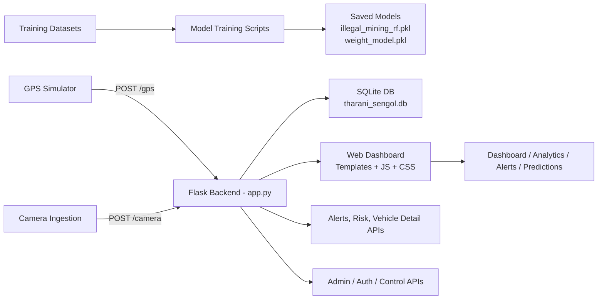
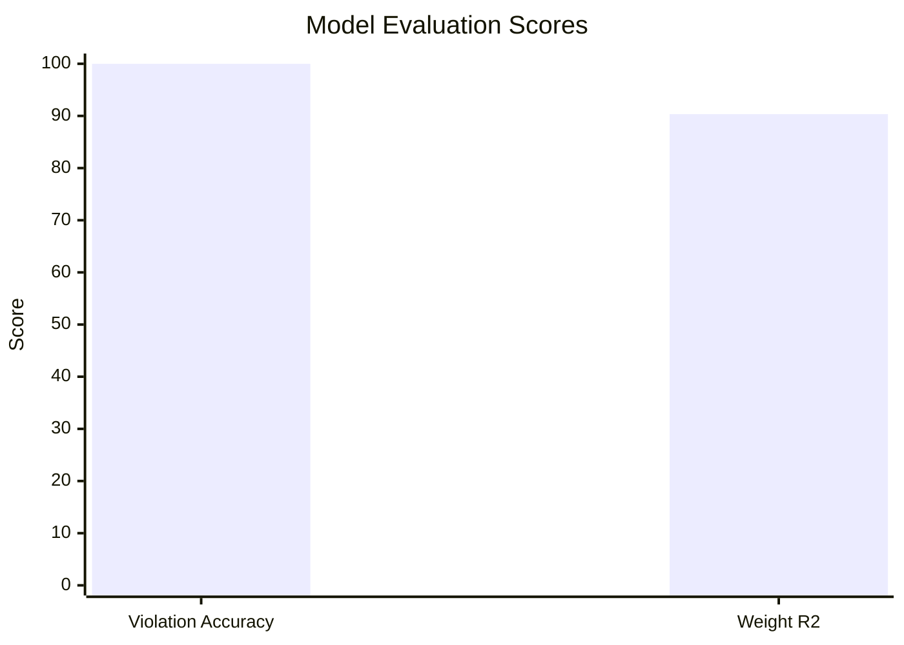
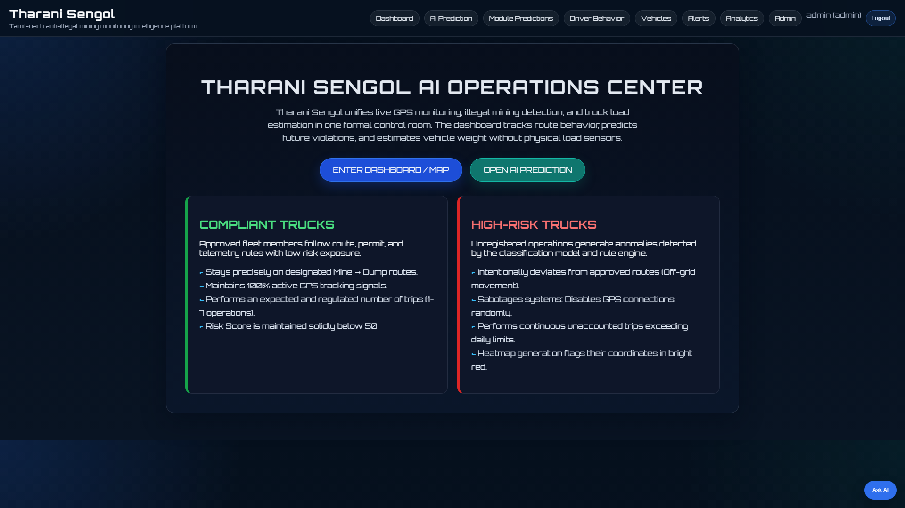
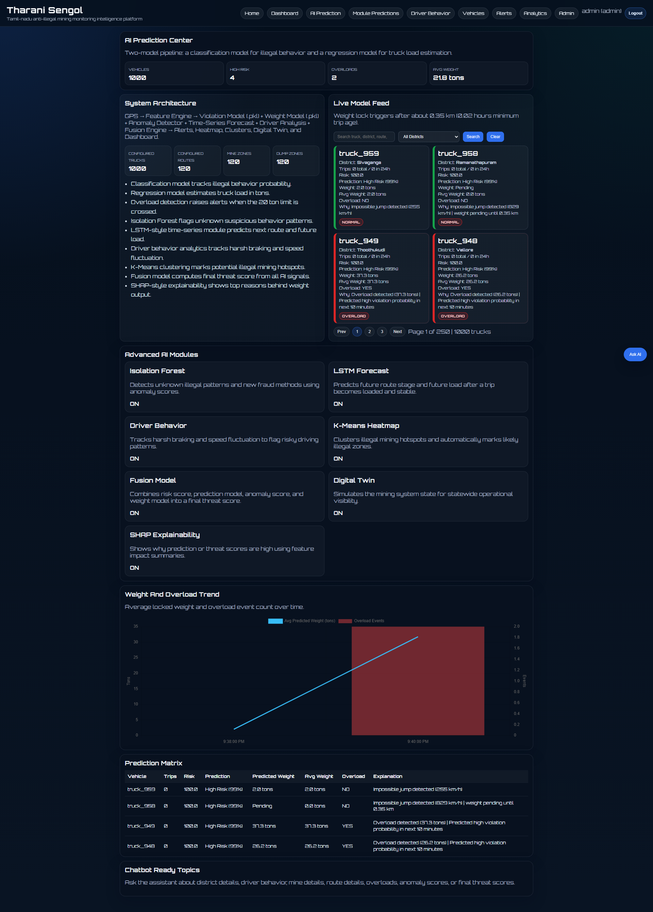
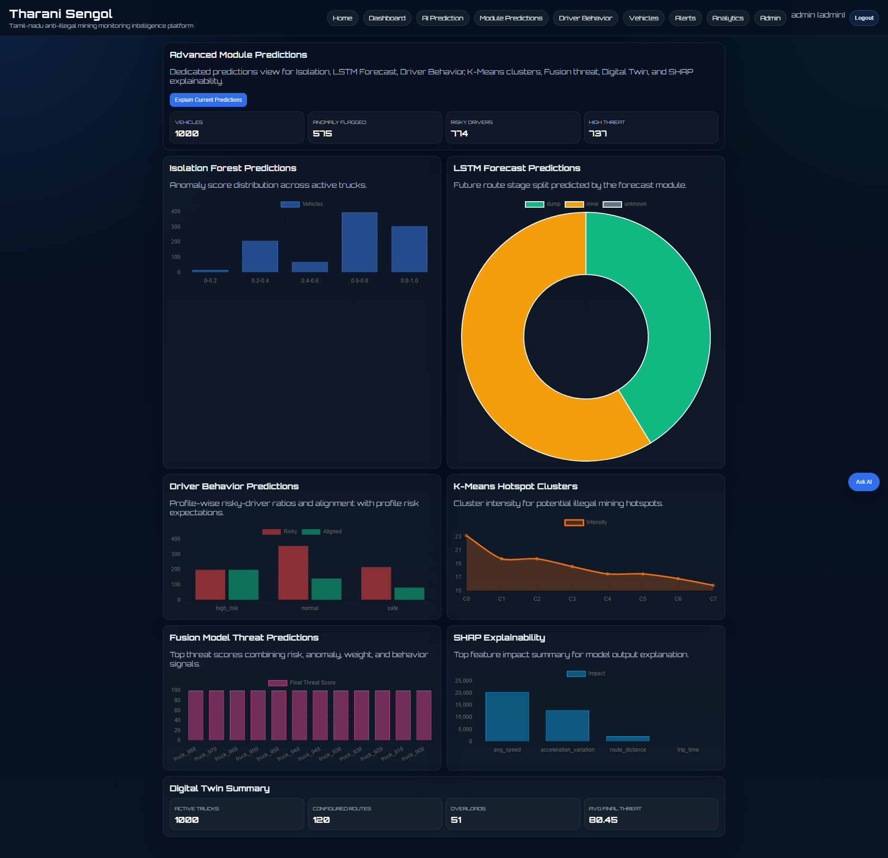
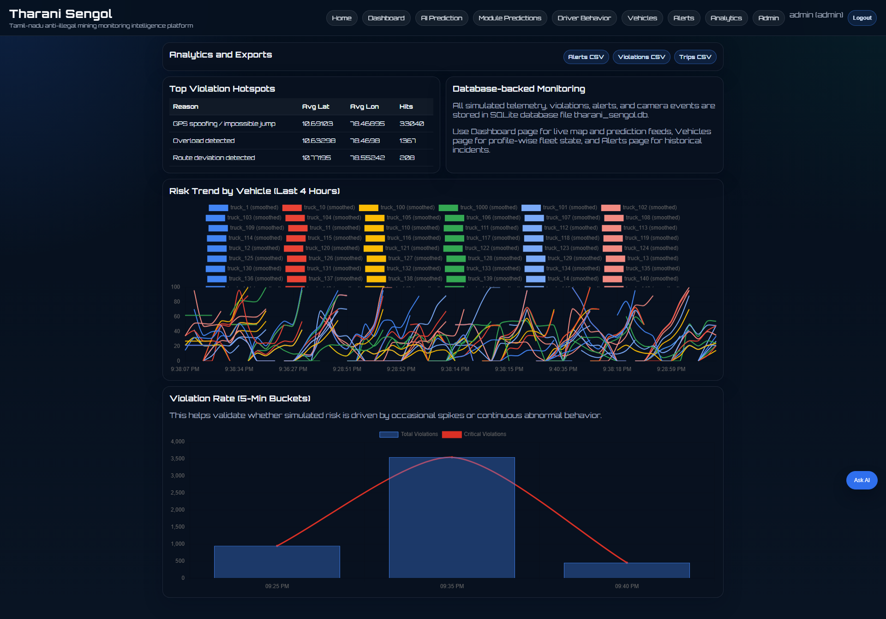
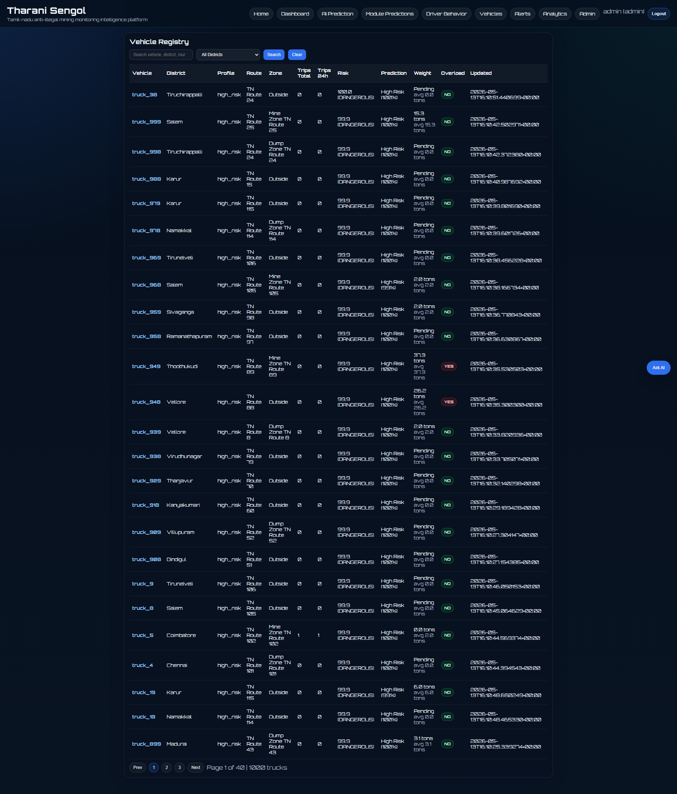

# Final Project Detail

## 1. Project Overview

**Tharani Sengol / GeoGuard** is an AI-powered vehicle monitoring and risk intelligence system built to track heavy trucks, detect risky behavior, estimate vehicle weight, and surface live analytics through a web dashboard.

The project combines telemetry ingestion, route simulation, rule-based risk scoring, machine learning inference, database-backed state management, and a browser-based control panel. It is designed for fleet monitoring use cases where overloaded vehicles, route violations, and abnormal driving patterns need to be detected quickly.

## 2. What The Project Solves

The system focuses on these core problems:

- Monitoring truck movement in real time
- Detecting illegal or risky driving behavior
- Estimating truck load/weight from trip characteristics
- Aggregating alerts and historical risk trends
- Providing an operator dashboard with searchable vehicle detail views
- Supporting admin and officer workflows with role-based access control

## 3. Technology Stack

### Backend

- Python
- Flask
- SQLite
- PyJWT
- scikit-learn
- joblib
- pandas
- numpy
- shapely
- OpenCV
- requests

### Frontend

- HTML5
- CSS3
- JavaScript
- Jinja2 templates through Flask

### ML and Analytics

- RandomForestClassifier for violation prediction
- RandomForestRegressor for weight prediction
- Isolation Forest for runtime anomaly detection
- Rule-based scoring for risk and compliance signals

### Supporting Tools

- qrcode for permit or verification workflows
- Pillow for image handling
- uvicorn and FastAPI are included in the environment requirements, although the primary backend entrypoint in this workspace is Flask

## 4. Project Structure

The repository is organized around the main runtime and supporting assets:

- `app.py` - main backend application and API server
- `run_all.py` - orchestration entrypoint for combined workflows
- `simulator.py` - GPS and fleet movement simulator
- `camera_ingest.py` - camera or virtual vehicle-count ingestion
- `capture.py` - capture utility
- `dataset_gen.py` - dataset generator for violation classification
- `weight_dataset_gen.py` - dataset generator for weight regression
- `train_model.py` - trains the violation classification model
- `train_weight_model.py` - trains the weight regression model
- `static/` - JavaScript, CSS, and browser assets
- `templates/` - Flask HTML templates
- `screenshots/` - saved UI screenshots
- `trichy_vehicle_dataset.csv` - classification dataset
- `weight_dataset.csv` - regression dataset
- `user_accounts.json` - local user store
- `geoguard-phase4/` - additional frontend/backend work area

## 5. End-To-End Architecture



## 6. How The System Works End To End

### Step 1: Data is generated or ingested

The project can receive live-like vehicle information from two sources:

- `simulator.py` generates truck GPS movement over Tamil Nadu routes
- `camera_ingest.py` generates camera-based truck count events, either from a physical camera or a virtual fallback

### Step 2: Backend receives telemetry

`app.py` exposes ingestion endpoints such as `/gps` and `/camera`. These endpoints accept the event data and update the current runtime state of each vehicle.

### Step 3: Vehicle state is updated

For each incoming event, the backend updates values like:

- Current latitude and longitude
- Speed
- Route deviation
- Trip count
- GPS signal loss
- Stops and trip duration
- Risk score and violation probability

### Step 4: Rules and ML inference run together

The backend combines:

- Heuristic rules for risk scoring
- Violation classification from the trained random forest model
- Weight estimation from the trained regression model
- Runtime anomaly detection for unusual behavior

This gives a multi-signal decision layer instead of depending on only one model.

### Step 5: Results are stored

The application persists operational data in SQLite and local JSON files, including:

- Vehicle records
- Trips
- GPS events
- Alerts
- Violations
- Predictions
- User accounts

### Step 6: Dashboard and reports render the result

The browser UI shows:

- Live fleet cards
- Vehicle details
- Analytics summaries
- Prediction modules
- Driver behavior views
- Alerts and admin tools

## 7. Main Backend Responsibilities

`app.py` is the core of the project. It manages:

- Authentication and JWT session handling
- Role-based access control for admin, officer, owner, and operator users
- GPS and camera event ingestion
- Risk computation and alert creation
- Route generation and route deviation checks
- Vehicle detail and summary APIs
- Analytics endpoints for dashboards and history views
- Permit and QR verification flows
- Simulation control settings for testing scenarios

## 8. Important API Groups

The main routes are grouped by function:

### Authentication and user management

- `/api/auth/login`
- `/api/auth/logout`
- `/api/auth/me`
- `/api/users`

### Telemetry and simulation

- `/gps`
- `/camera`
- `/api/control-state`
- `/api/admin/control`
- `/api/admin/scenario`

### Vehicles and trips

- `/api/vehicles`
- `/api/lorries`
- `/api/trips`
- `/api/vehicle/<vehicle_id>/detail`
- `/api/vehicle/<vehicle_id>/explain`

### Alerts and history

- `/api/alerts`
- `/api/history/risk`
- `/api/history/violation-rate`
- `/api/illegal-trips`
- `/api/permit-violations`

### Analytics and dashboards

- `/api/heatmap`
- `/api/heatmap-data`
- `/api/heatmap/clusters`
- `/api/risk-timeline`
- `/api/ai-overview`
- `/api/module-predictions`
- `/api/driver-behavior`
- `/api/tn-dashboard-stats`
- `/api/digital-twin`

## 9. Machine Learning Models

### A. Violation Classification Model

File: `illegal_mining_rf.pkl`

Training script: `train_model.py`

Purpose:

- Predict whether a trip is associated with risky or illegal behavior

Input features:

- speed
- trip_count
- route_deviation
- gps_signal_loss
- time_of_day
- day_of_week
- risk_score

Output:

- Violation label or probability

### B. Weight Regression Model

File: `weight_model.pkl`

Training script: `train_weight_model.py`

Purpose:

- Estimate truck weight from trip statistics

Input features:

- trip_time
- avg_speed
- max_speed
- stops_count
- acceleration_variation
- route_distance
- trip_number
- time_of_day

Output:

- Predicted weight in tons
- Error metric for model quality

### C. Runtime Anomaly Detection

The backend also uses Isolation Forest logic during runtime to flag unusual behavior patterns from live telemetry.

## 10. Model Evaluation Summary

The latest training runs in this workspace produced the following results:

| Model | Metric | Value | Notes |
| --- | --- | --- | --- |
| Violation classifier | Test accuracy | 100.00% | Random forest trained on `trichy_vehicle_dataset.csv` |
| Weight regressor | R2 score | 0.9034 | Random forest trained on `weight_dataset.csv` |
| Weight regressor | MAE | 1.241 tons | Lower is better |
| Weight regressor | Training rows | 50,000 | Generated dataset size |
| Violation classifier | Test rows | 20,000 | Holdout set from the generated classification dataset |

### Accuracy Chart



### Interpretation

- The violation classifier is currently performing at a perfect score on the generated test split used by the script.
- The weight regression model explains about 90.34% of the variance in the test split.
- MAE of 1.241 tons means the regression model’s typical absolute error is low enough to be useful for operational estimates.

## 11. UI Screenshots

The project already includes example screenshots that show the main frontend modules. These can be used in reports or presentations.

### Dashboard



### AI Prediction View



### Module Predictions



### Analytics



### Vehicles



## 12. Frontend Pages And Their Role

The UI is split into separate views so each audience can focus on a specific operational task.

- `dashboard.html` - live overview with alerts and summary cards
- `vehicles.html` - vehicle list and search/filter experience
- `vehicle_detail.html` - full record for a single vehicle
- `analytics.html` - trends and historical reporting
- `ai_prediction.html` - model outputs and prediction dashboards
- `module_predictions.html` - per-module prediction summaries
- `driver_behavior.html` - behavior patterns and driver analytics
- `alerts.html` - alert monitoring and history
- `admin.html` - administrative actions and configuration
- `login.html` - authentication entry point
- `government_dashboard.html` - oversight-oriented reporting view

## 13. JavaScript Modules

The frontend logic is distributed across modular scripts in `static/`:

- `dashboard.js` - real-time dashboard updates
- `vehicles.js` - vehicle table and filters
- `vehicle_detail.js` - single vehicle drill-down
- `analytics.js` - chart and trend logic
- `ai_prediction.js` - model output visualization
- `module_predictions.js` - module score presentation
- `driver_behavior.js` - behavior insights
- `government_dashboard.js` - government-facing metrics
- `auth.js` - sign-in and session handling
- `chatbot.js` - conversational helper
- `site.css` - global visual styling

## 14. Data Files And Their Purpose

### Classification dataset

`trichy_vehicle_dataset.csv` contains rows with:

- vehicle id
- timestamp
- coordinates
- speed
- trip count
- route deviation
- GPS signal loss
- time of day
- day of week
- risk score
- violation label

### Weight dataset

`weight_dataset.csv` contains rows with:

- trip time
- average speed
- max speed
- stop count
- acceleration variation
- route distance
- trip number
- time of day
- target weight

## 15. Why The Project Is Modular

This project is intentionally split into separate pieces so each layer can be worked on independently:

- Data generation can be changed without touching the dashboard
- Model training can be repeated without changing the backend APIs
- Frontend pages can evolve without rewriting ingestion logic
- Authentication and role control remain isolated from telemetry processing

## 16. Typical User Flow

A normal operational flow looks like this:

1. A user signs in through the login page
2. The dashboard loads live vehicle summaries
3. Simulator or ingestion scripts send GPS and camera events to the backend
4. The backend computes risk, predictions, and alerts
5. The UI updates with vehicle cards, analytics, and drill-down pages
6. Admin users can change simulation controls, manage accounts, or review alerts

## 17. How To Run The Project

### Install dependencies

```bash
python -m venv .venv
.venv\Scripts\activate
pip install -r requirements.txt
```

### Run the application

```bash
python run_all.py
```

### Train models again

```bash
python train_model.py
python train_weight_model.py
```

## 18. Final Summary

This project is a complete fleet monitoring and risk intelligence platform with:

- live vehicle telemetry ingestion
- camera-based count monitoring
- route and behavior analytics
- two trained machine learning models
- a dashboard for review, operations, and administration
- screenshotable UI flows for reporting and presentation

The current document is intended to serve as the single project explanation file for technical review, presentation, or submission.
